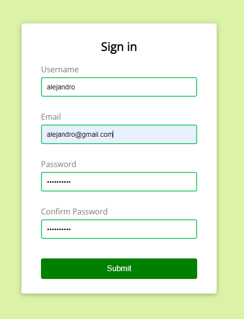

# ✅ Form validator 
A validator that checks the validity of an email address and password to create an account on a platform.

## 🔎 View 

## 🛠️ How to use
* Clone or download this repository to your local machine.
* Open the file index.html in your web browser.